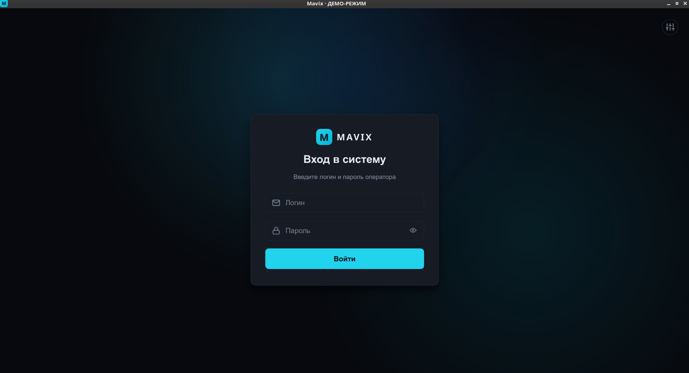
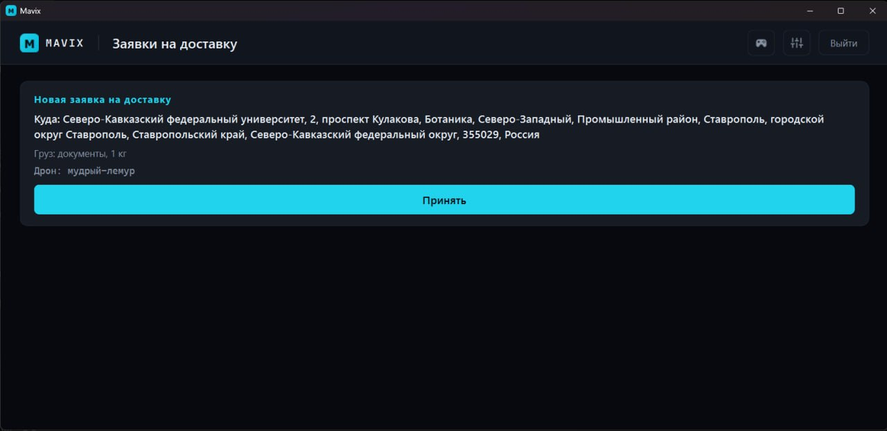
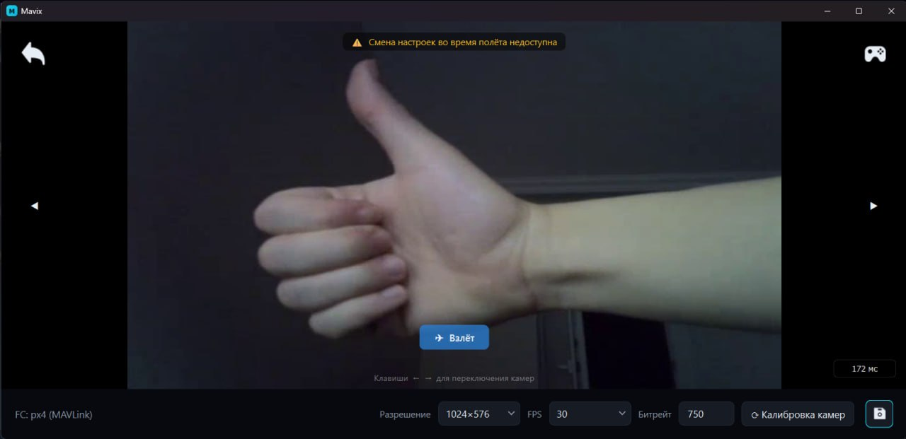
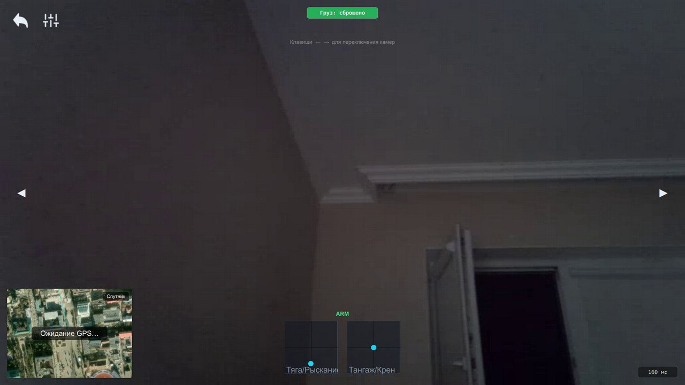
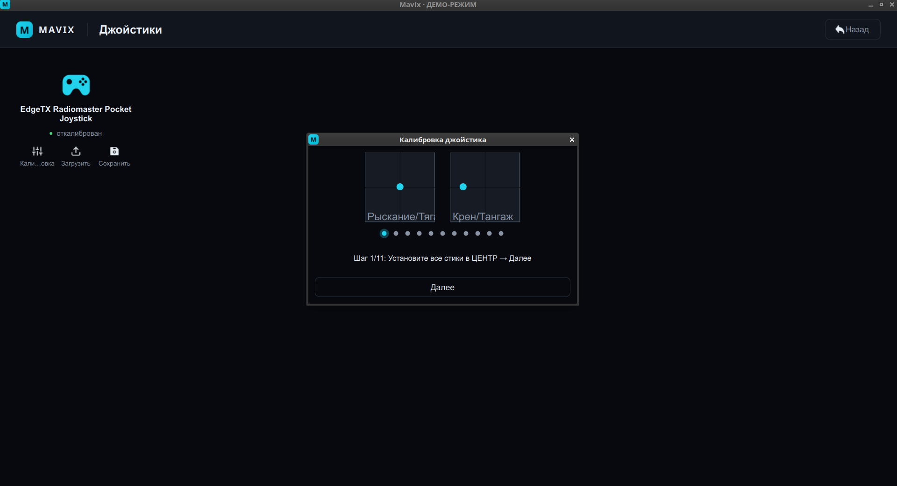

# MavixDesktop

Приложение оператора системы автоматизированной доставки малогабаритных грузов
дронами **Mavix**. Приём заявок, видео и телеметрия с борта по WebRTC, карта,
управление дроном (джойстик/QGroundControl), сброс груза.

## Скриншоты

| | |
|---|---|
|  |  |
| Окно «Вход в систему» | Окно «Заявки на доставку» |
|  |  |
| Полётное окно: видео, телеметрия, индикатор ФК | Полётное окно: видео с картой и стиками |



Окно «Калибровка джойстика».

## Стек
Python 3.12 · PySide6 (Qt6) · aiortc · PyAV · pygame · QtNetwork. Сборка — PyInstaller.

## Быстрый старт
```bash
python -m venv .venv && source .venv/bin/activate
pip install -e .
python -m mavixdesktop
```
Готовые сборки (.exe / .AppImage) можно скачать с сайта MavixWeb. Регистрация не
нужна — логин и пароль оператору выдаёт администратор.

## Тесты
```bash
QT_QPA_PLATFORM=offscreen python -m pytest -q     # полный набор — зелёный
```

## Документация
- [TECHNICAL.md](TECHNICAL.md) — техническое описание (ГОСТ 19.402): структура,
  WebRTC, карта, джойстик/QGC, «Сложности и принятые решения».
- [USER_GUIDE.md](USER_GUIDE.md) — руководство оператора (ГОСТ 19.505): вход,
  приём заявки, управление, сброс груза.
- Совместимость WebRTC и TURN — [../MavixBoard/WEBRTC_TURN_NOTES.md](../MavixBoard/WEBRTC_TURN_NOTES.md).
- Обзор всей системы — корневой [README.md](../README.md).
