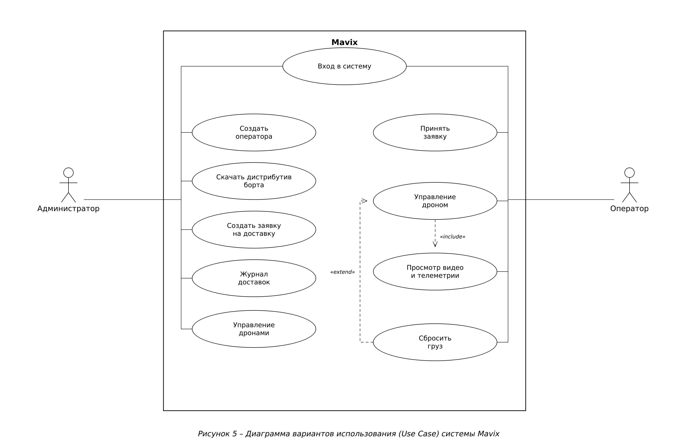

# MavixDesktop — Техническое описание

Документ составлен по ГОСТ 19.402-78 «Описание программы» (ЕСПД).

## 1. Аннотация

MavixDesktop — приложение оператора системы доставки грузов дронами Mavix.
Оператор входит под выданными учётными данными, видит заявки на доставку,
принимает их, подключается к дрону по WebRTC (видео + телеметрия + карта),
управляет полётом (джойстик → CRSF, либо MAVLink через QGroundControl) и
выполняет сброс груза.

## 2. Общие сведения

- **Наименование:** MavixDesktop.
- **Стек:** Python 3.12, PySide6 (Qt), aiortc (WebRTC), pygame (джойстик),
  PyAV (H.264), QtNetwork (тайлы карты). Сборка — PyInstaller (`.exe` + Linux-бинарь, `--onefile`).
- **Связь:** REST + WS-сигналинг с MavixServer; WebRTC P2P с MavixBoard;
  локально — QGroundControl (MAVLink-полёт).

## 3. Функциональное назначение

- Вход оператора, получение и приём заявок (первый принявший — ведёт).
- Приём видео (несколько камер) и телеметрии (GPS/курс/батарея) по WebRTC.
- Карта (нативный QPainter-виджет: спутник/улицы, поворот по курсу, маркеры).
- Управление: CRSF-кадры с джойстика → борт; либо запуск QGroundControl и
  фоновый проброс ARM/DISARM и AUTO-RTL по packet-каналу.
- Сброс груза (кнопка джойстика/экрана) с отметкой доставки `delivered`.

## 4. Описание логической структуры

`App` (QMainWindow) управляет экранами; `SessionCoordinator` (фоновый asyncio-
поток) ведёт REST/WS/WebRTC через `WebRTCManager` и `PeerSession`; `VideoManager`
принимает треки и отдаёт кадры; `FlightWindow` — экран управления (видео, стики,
карта `MapWidget`, кнопка сброса); `JoystickInput` — чтение джойстика.

Сценарии оператора (Use Case):



Установление WebRTC-сессии:


## 5. Используемые технические средства

ОС: Linux (x64) / Windows 10+. PySide6 (Qt6) с QtNetwork; aiortc, PyAV, pygame.
Для MAVLink-полёта — внешняя программа QGroundControl. Джойстик — USB.

## 6. Установка и запуск

```bash
python -m venv .venv && source .venv/bin/activate
pip install -e .
python -m mavixdesktop
```
Готовые сборки (`.exe` + Linux-бинарь) отдаёт сайт MavixWeb; сборка — `StartUp/build/`.
Настройки (адрес сервера, STUN/TURN, force-relay) — через `.env`/config; адрес
WS можно переопределить. Регистрация не нужна — логин/пароль выдаёт администратор.

## 7. Проверка работы

```bash
./run_tests.sh             # все тесты с покрытием (Qt в offscreen-режиме)
```
Модульное и интеграционное тестирование — pytest; покрытие через pytest-cov
(`run_tests.sh`, отчёт в `htmlcov/`). Текущий результат: **281 тест проходит,
покрытие кода 72%**. Тесты конструируют экраны в offscreen-режиме Qt и
прогоняют отрисовку (`grab()`), модальные диалоги нейтрализуются; покрыты также
кодеки команд, видео-менеджер, разбор телеметрии и сетевой клиент.

## 8. Сообщения системному программисту

- `libGL.so.1: cannot open` → доустановить `libgl1 libegl1 libxkbcommon0`.
- Джойстик не виден сразу → задержка доставки `JOYDEVICEADDED` от udev/SDL
  (опрос на странице джойстиков идёт каждую секунду).
- ICE failed / нет видео → STUN/TURN, см. [MavixBoard/WEBRTC_TURN_NOTES.md](../MavixBoard/WEBRTC_TURN_NOTES.md).

## 9. Журналирование

Логи с префиксом `[app]`/`[coord]`/`[ice]`. При сбое — Python-стек через
`faulthandler` в `/tmp/mavix_crash.log`. Текст — на русском.

## 10. Безопасность учётных данных

Токены оператора хранятся локально (`server/token_store.py`); refresh при
истечении. Регистрация в приложении отсутствует — доступ выдаёт администратор.

## 11. Сложности и принятые решения

- **Карта без QtWebEngine.** Chromium-движок (`QWebEngineView`) ронял приложение
  при открытии QGC на машинах с самосборной libGL. Карта переписана на нативный
  `QPainter` (`ui/screens/map_widget.py`): растровые тайлы (Esri/OSM),
  асинхронная загрузка через `QNetworkAccessManager`, кэш, поворот по курсу.
- **Совместимость aiortc ↔ webrtcbin.** Borт-сторона — GStreamer `webrtcbin`;
  потребовались разбор trickle-ICE-кандидатов штатным `candidate_from_sdp`,
  нативный relay-only через `relay_patch.py` (подмена `aioice.Connection`),
  приоритет локального TURN-конфига. Подробно —
  [MavixBoard/WEBRTC_TURN_NOTES.md](../MavixBoard/WEBRTC_TURN_NOTES.md).
- **Джойстик и QGroundControl.** В passive-режиме (MAVLink) QGC и приложение
  читают один джойстик; ARM/DISARM шлём отдельной командой по packet-каналу
  параллельно QGC. Hot-plug — через `pygame.event.pump()` (а не хрупкий
  `quit()+init()`). Зависание при открытии QGC устранено откатом ошибочной
  «защиты» декодера (приведено к рабочему поведению ветки `remote_control`).
- **Поиск QGC.** Авто-поиск исполняемого файла ограничен по времени (≤5 с),
  глубине (≤2) и числу записей: раньше полный `rglob` по дискам `C:/ D:/ E:/`
  подвешивал GUI на минуты. Совпадение строгое — `QGroundControl.exe`
  (а не `startswith`), иначе под него попадал инсталлятор
  `QGroundControl-installer-*.exe` и приложение запускало именно его. Найденный
  путь кэшируется в `~/.config/mavixdesktop/qgc_path.txt`; если не найден —
  пользователь указывает файл вручную.
- **Одно окно.** Полётное окно открывается с прятанием главного окна — у
  приложения остаётся одно видимое окно (не два в alt-tab).

## 12. Принципы проектирования (SOLID / DRY / KISS / YAGNI)

Примеры из кода MavixDesktop.

- **S — единственная ответственность.** `ui/managers/video.py` (VideoManager) —
  только приём/отрисовка кадров; `ui/screens/map_widget.py` (MapWidget) — только
  карта; `fc/encoder.py` — только кодирование RC-кадров; `SessionCoordinator` —
  сеть/сессия.
- **O — открытость/закрытость.** Источники тайлов карты заданы словарём
  `_SOURCES` в `map_widget.py`: добавление слоя (спутник/улицы/новый провайдер) —
  запись в словарь, логика рендера и загрузки не трогается.
- **L — подстановка Лисков.** `ui/managers/connection.py` и `demo_connection.py`
  — взаимозаменяемые менеджеры подключения с одним контрактом; `relay_patch.py` —
  подкласс `aioice.Connection`, подставляемый вместо базового без правок aiortc.
- **I — разделение интерфейсов.** Узкие необязательные колбэки координатора
  (`on_telemetry`, `on_battery_changed`, `on_delivery_offer`, `on_drone_offline`
  …) — подписчик берёт только нужные, без «толстого» интерфейса.
- **D — инверсия зависимостей.** `SessionCoordinator` получает зависимости извне
  (signal-client, фабрики), `WebRTCManager` — `send`-callable и webrtc-элемент;
  конструкция не зашита внутри.
- **DRY.** `map_widget.telemetry_to_args()` — единственное место разбора
  telemetry-payload в (lat, lon, heading); используется и картой, и приложением.
- **KISS.** Карта — нативный `QPainter` поверх растровых тайлов вместо QtWebEngine
  (нет Chromium/GL — проще и не роняет приложение).
- **YAGNI.** Убраны лишние абстракции и «защита» декодера на ложной предпосылке
  (поведение приведено к рабочему `remote_control`); в `.env`/конфиге — только
  реально используемые параметры.
